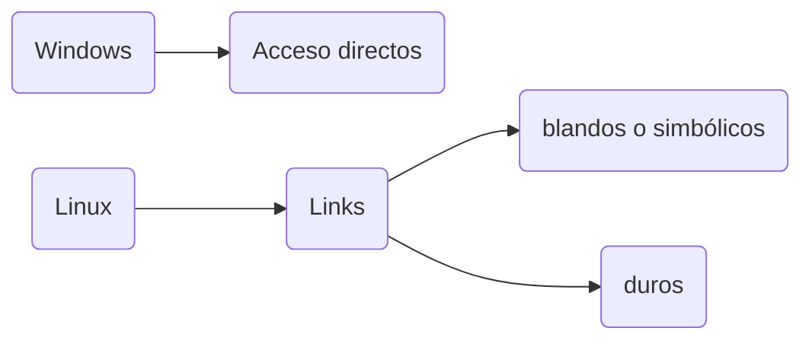
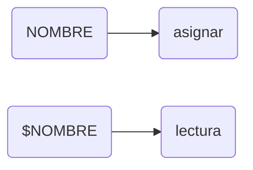

# RegExp
Los ``Regexp`` son patrones que permiten identificar cadenas que cumplen las condiciones del patron ejemplo
## *
  significa que esta 0 o mas veces 
  Ejemplo:
  ```bash
  #!/bin/bash

# Crear un archivo con algunos textos de ejemplo
echo -e "hola\nhooola\nhooooooola\nadios\nhola mundo" > textos.txt

# Buscar cualquier línea que empiece con "ho" y tenga 0 o más "o" antes de "la"
grep "ho*la" textos.txt

```
## +
el `+` significa que tiene que estar una o mas veces<br>
```bash
#!/bin/bash

# Crear un archivo con algunos textos de ejemplo
echo -e "hola\nhooola\nhooooooola\nadios\nhola mundo" > textos.txt

# Buscar cualquier línea que empiece con "ho" y tenga 1 o más "o" antes de "la"
grep -E "ho+la" textos.txt

```
## {n}
`{n}` significa que se repite n veces<br>
Ejemplo:
```bash
#!/bin/bash

# Crear un archivo con algunos textos de ejemplo
echo -e "hooa\nhooola\nhooooooola\nhoooooooola\nadios" > textos.txt

# Buscar cualquier línea que tenga "ho" seguido de exactamente 3 "o"
grep -E "ho{3}la" textos.txt
```
## {n,m}
se repite como minimo n veces y como maximo m veces<br>
Ejemplo:
```bash 
#!/bin/bash

# Crear un archivo con algunos textos de ejemplo
echo -e "hoooola\nhooooooola\nhooooooooola\nhooola\nhooooola" > textos.txt

# Buscar cualquier línea que tenga "ho" seguido de entre 2 y 4 "o"
grep -E "ho{2,4}la" textos.txt

```
## .
significa que puede ser cualquier caracter menos \n 
```bash
#!/bin/bash

# Crear un archivo con algunos textos de ejemplo
echo -e "hola\nhoala\nho2la\nhooooola\nho-la\nho@la\nadios" > textos.txt

# Reemplazar "ho" seguido de cualquier carácter y luego "la" por "saludo"
sed -i 's/ho.la/saludo/g' textos.txt

# Mostrar el contenido del archivo después de la sustitución
cat textos.txt
```
## []
significa que es un conjunto de caracteres:<br>Ejemplo:
```bash 
#!/bin/bash

# Crear un archivo con algunos textos de ejemplo
echo -e "hola\nHola\nMundo\nadios\nBlaBla" > textos.txt

# Buscar cualquier línea que contenga una letra mayúscula
grep "[A-Z]" textos.txt
```
## ^
para el ``^`` hay de dos usos:
* dentro de corchetes([]):dice todo menos lo que hay en un conjunto
    ```bash
    #!/bin/bash

    # Crear un archivo con algunos textos de ejemplo
    echo -e "rhythm\nbcdfgh\nhello\nworld" > textos.txt

    # Buscar las líneas que no contienen vocales
    grep "^[^aeiouAEIOU]*$" textos.txt

    ```
* Sin estar dentro de un corchete: significa que empieza por eso
    ```bash
    #!/bin/bash

    # Crear un archivo con algunos textos de ejemplo
    echo -e "hola\nadios\nhoala\nho2la\nhola mundo" > textos.txt

    # Buscar las líneas que comienzan con "ho"
    grep "^ho" textos.txt

    ```
## $
termina por ese caracter<br>
ejemplo:
```bash
#!/bin/bash

# Crear un archivo con algunos textos de ejemplo
echo -e "hola\nadios\nhoala\nho2la\nhola mundo" > textos.txt

# Buscar las líneas que terminan con "la"
grep "la$" textos.txt

```
# ENLACES

Un enlace es un fichero que redirige a otro.<br>
todos los archivos tienen un **inodo** que es unico para ese archivo
## Enlace blando 
Un **enlace blando** es un enlace que crea un fichero con la ruta del fichero del que se crea el enlace.<br>
El enlace blando tiene un **inodo distinto** al del fichero original por el que si eliminas el fichero original no se borrara el enlace blando pero estara vacio<br>
Se hace asi:
```bash
ln -s [fichero original] [ruta del enlace]
``` 
ejemplo:<br>
para crear un enlace del `fichero.txt` llamado `blando.txt`
```bash
ln -s fichero.txt blando.txt
```
## Enlace duro
Un enlace duro es un enlace con el mismo inodo por lo que al borrar el original no le pasara nada al enlace.<br>
Como se hace:
```bash
ln -i [fichero original] [ruta del enlace]
```
Ejemplo:
```bash
ln -i fichero.txt duro.txt
```
# VARIABLES 
se pueden mencionar de dos maneras

los tipos de datos que almacenas las variables son cadenas de texto
## Como hacer
Para asignar es:
```bash
[variable] = valor
```
Ejemplo:
```bash
edad= 18 y medio
```
para leer es poniendo `$` delante de la variable
Ejemplo:
```bash 
echo "Mi edad es $edad"
```
resultado
```
Mi edad es 18 y medio
```
## Con comandos
Se puede utilizar con comandos por ej:
```bash 
listado = 'ls -i'
```
resultado:
```
# RegExp
Los ``Regexp`` son patrones que permiten identificar cadenas que cumplen las condiciones del patron ejemplo
## *
  significa que esta 0 o mas veces 
  Ejemplo:
  ```bash
  #!/bin/bash

# Crear un archivo con algunos textos de ejemplo
echo -e "hola\nhooola\nhooooooola\nadios\nhola mundo" > textos.txt

# Buscar cualquier línea que empiece con "ho" y tenga 0 o más "o" antes de "la"
grep "ho*la" textos.txt

```
## +
el `+` significa que tiene que estar una o mas veces<br>
```bash
#!/bin/bash

# Crear un archivo con algunos textos de ejemplo
echo -e "hola\nhooola\nhooooooola\nadios\nhola mundo" > textos.txt

# Buscar cualquier línea que empiece con "ho" y tenga 1 o más "o" antes de "la"
grep -E "ho+la" textos.txt

```
## {n}
`{n}` significa que se repite n veces<br>
Ejemplo:
```bash
#!/bin/bash

# Crear un archivo con algunos textos de ejemplo
echo -e "hooa\nhooola\nhooooooola\nhoooooooola\nadios" > textos.txt

# Buscar cualquier línea que tenga "ho" seguido de exactamente 3 "o"
grep -E "ho{3}la" textos.txt
```
## {n,m}
se repite como minimo n veces y como maximo m veces<br>
Ejemplo:
```bash 
#!/bin/bash

# Crear un archivo con algunos textos de ejemplo
echo -e "hoooola\nhooooooola\nhooooooooola\nhooola\nhooooola" > textos.txt

# Buscar cualquier línea que tenga "ho" seguido de entre 2 y 4 "o"
grep -E "ho{2,4}la" textos.txt

```
## .
significa que puede ser cualquier caracter menos \n 
```bash
#!/bin/bash

# Crear un archivo con algunos textos de ejemplo
echo -e "hola\nhoala\nho2la\nhooooola\nho-la\nho@la\nadios" > textos.txt

# Reemplazar "ho" seguido de cualquier carácter y luego "la" por "saludo"
sed -i 's/ho.la/saludo/g' textos.txt

# Mostrar el contenido del archivo después de la sustitución
cat textos.txt
```
## []
significa que es un conjunto de caracteres:<br>Ejemplo:
```bash 
#!/bin/bash

# Crear un archivo con algunos textos de ejemplo
echo -e "hola\nHola\nMundo\nadios\nBlaBla" > textos.txt

# Buscar cualquier línea que contenga una letra mayúscula
grep "[A-Z]" textos.txt
```
## ^
para el ``^`` hay de dos usos:
* dentro de corchetes([]):dice todo menos lo que hay en un conjunto
    ```bash
    #!/bin/bash

    # Crear un archivo con algunos textos de ejemplo
    echo -e "rhythm\nbcdfgh\nhello\nworld" > textos.txt

    # Buscar las líneas que no contienen vocales
    grep "^[^aeiouAEIOU]*$" textos.txt

    ```
* Sin estar dentro de un corchete: significa que empieza por eso
    ```bash
    #!/bin/bash

    # Crear un archivo con algunos textos de ejemplo
    echo -e "hola\nadios\nhoala\nho2la\nhola mundo" > textos.txt

    # Buscar las líneas que comienzan con "ho"
    grep "^ho" textos.txt

    ```
## $
termina por ese caracter<br>
ejemplo:
```bash
#!/bin/bash

# Crear un archivo con algunos textos de ejemplo
echo -e "hola\nadios\nhoala\nho2la\nhola mundo" > textos.txt

# Buscar las líneas que terminan con "la"
grep "la$" textos.txt

```
# ENLACES

Un enlace es un fichero que redirige a otro.<br>
todos los archivos tienen un **inodo** que es unico para ese archivo
## Enlace blando 
Un **enlace blando** es un enlace que crea un fichero con la ruta del fichero del que se crea el enlace.<br>
El enlace blando tiene un **inodo distinto** al del fichero original por el que si eliminas el fichero original no se borrara el enlace blando pero estara vacio<br>
Se hace asi:
```bash
ln -s [fichero original] [ruta del enlace]
``` 
ejemplo:<br>
para crear un enlace del `fichero.txt` llamado `blando.txt`
```bash
ln -s fichero.txt blando.txt
```
## Enlace duro
Un enlace duro es un enlace con el mismo inodo por lo que al borrar el original no le pasara nada al enlace.<br>
Como se hace:
```bash
ln -i [fichero original] [ruta del enlace]
```
Ejemplo:
```bash
ln -i fichero.txt duro.txt
```
# VARIABLES 
se pueden mencionar de dos maneras

los tipos de datos que almacenas las variables son cadenas de texto
## Como hacer
Para asignar es:
```bash
[variable] = valor
```
Ejemplo:
```bash
edad= 18 y medio
```
para leer es poniendo `$` delante de la variable
Ejemplo:
```bash 
echo "Mi edad es $edad"
```
resultado
```
Mi edad es 18 y medio
```
## Con comandos
Se puede utilizar con comandos por ej:
```bash 
listado = 'ls -i'
```
## $?
esta variable se pone después del comando para ver el estado del comando
si sale bien da `0` los demás resultados son códigos de error<br>
ejemplo:
```