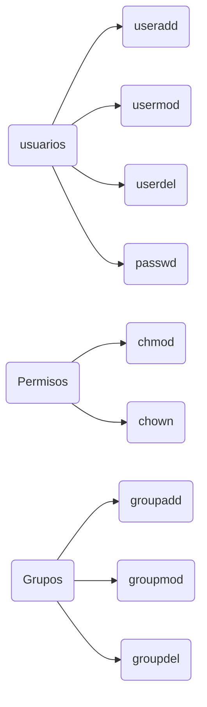
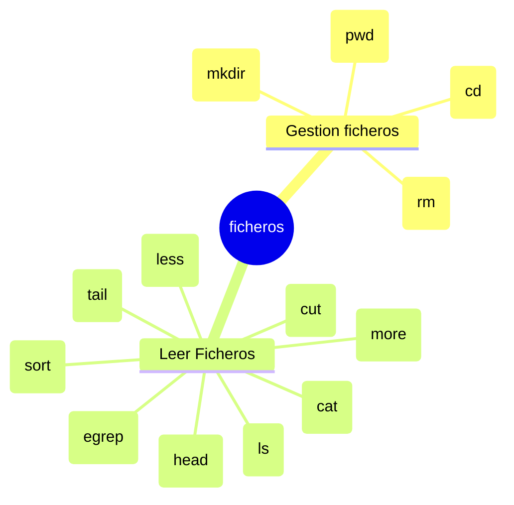

# usuarios

```mermaid
flowchart LR
U(usuarios )
ua(useradd)
um(usermod)
ud(userdel)
p(passwd)
U-->ua
U-->um
U-->ud
U-->p
P(Permisos)
chm(chmod)
cho(chown)
P-->chm
P-->cho
G(Grupos)
ga(groupadd)
gm(groupmod)
gd(groupdel)
G-->ga
G-->gm
G-->gd
```
# ficheros

```mermaid
mindmap
root((ficheros))
    Gestion ficheros
        p(pwd)
        m(mkdir)
        c(cd)
        r(rm) 
    Leer Ficheros
        ca(cat)
        h(head)
        t(tail)
        l(ls)
        mo(more)
        le(less)
        cu(cut)
        e(egrep)
        s(sort)
```
